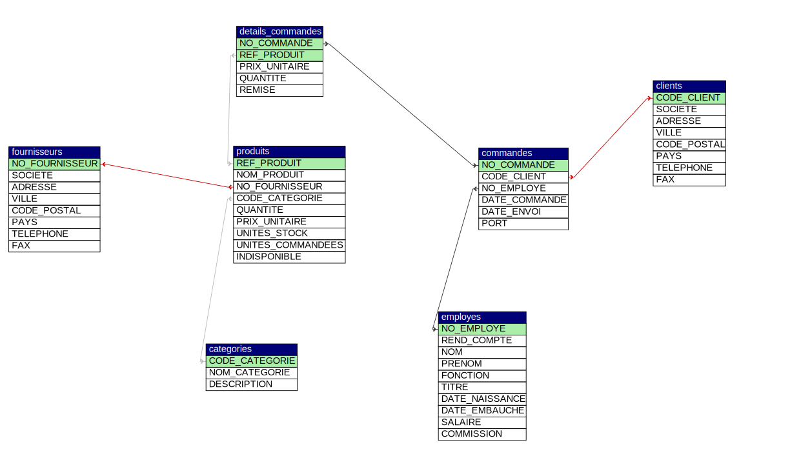

# Correction exercice 1.2 : modèle relationnel

A partir des schémas fil rouge ci-après

et [schéma détaillé](../northwind/schema.pdf)
1. Une commande peut être effectuée en toute autonomie par un client sans l'intervention d'un employé.
- **Faux**, il faut obligatoire un client et un employé
2. Un employé a obligatoirement un supérieur hiérarchique.
- **Faux**, l'attribut REND_COMPTE peut être NULL (sans valeur)
3. 2 Catégories peuvent avoir le même nom.
- **Vrai**, pas de contrainte d'unicité sur la colonne nom et nom n'est pas clé primaire de la table non plus.
4. La seule information non obligatoire pour un fournisseur est le numéro de fax.
- **Vrai**, le champ FAX peut être NULL
5. Une même référence produit peut être fournit par plusieurs fournisseurs.
- **Faux**, REF_PRODUIT est clé primaire donc il ne peut pas y avoir 2 produits avec la même référence.
6. Il n'est pas possible de connaitre le total d'une commande car cette information n'est pas stockée.
- **Faux**, à partir du prix, de la quantité et la remise, on peut calculer le total.
- Les champs calculables (des dérivées) ne sont jamais stockés en base de données, exemple, pour le prix, on stocke le HT et la TVA.
7. NO_COMMANDE dans DETAILS_COMMANDES est à la fois clé primaire et clé étrangère.
- **Vrai**, DETAILS_COMMANDES a la particularité d'avoir en clé primaire le couple REF_PRODUIT et NO_COMMANDE. Et REF_PRODUIT est clé étrangère faisant référence à la clé primaire de PRODUIT, idem pour NO_COMMANDE ref. clé primaire de COMMANDES.
8. La clé primaire de DETAILS_COMMANDES est le couple NO_COMMANDE et REF_PRODUIT.
- **Vrai**
9. Un employé peut directement rendre des comptes à plusieurs autres employés.
- **Faux**, il peut rendre des comptes qu'à un seul employé, par contre, ce dernier peut à son tour rendre des comptes à un autre employé.
10. Une entité (entreprise ou particulier) peut exister à la fois en tant que client et fournisseur.
- **Vrai**, rien n'empêche un client d'être aussi un fournisseur et vis-versa.
